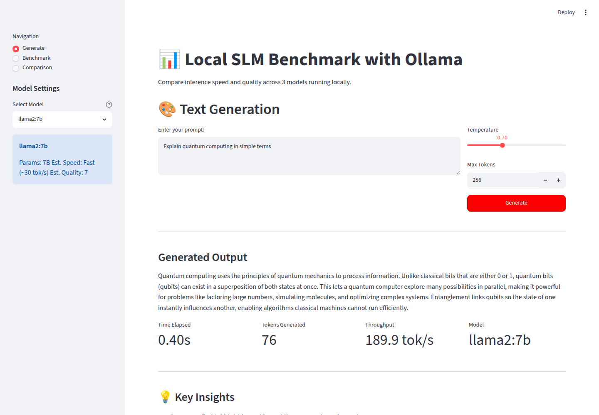
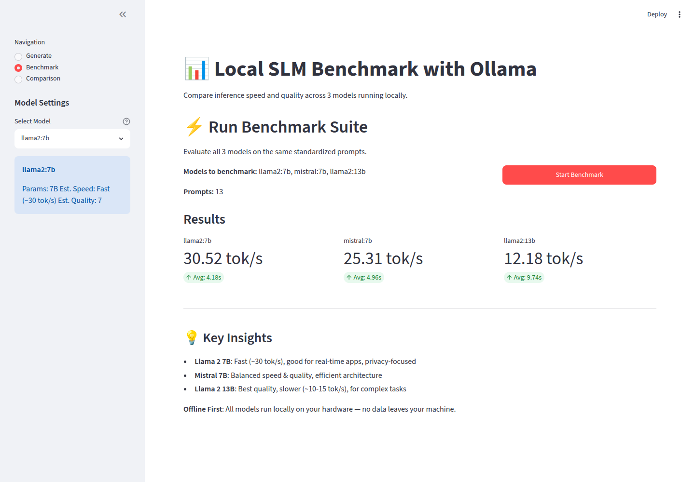
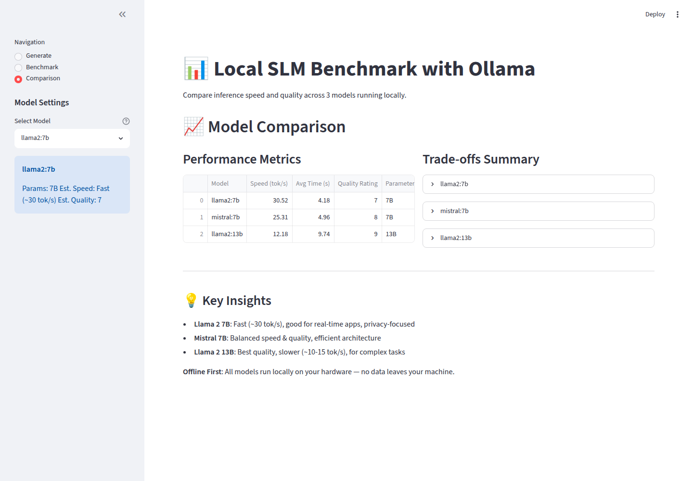

# Local SLM Benchmark with Ollama

Run small language models entirely offline on your hardware. Benchmark inference performance, compare quality-vs-speed tradeoffs, and understand the real-world constraints of local inference.

## 🎯 Project Goals

- **Privacy First**: All inference happens locally—no data leaves your machine
- **Performance Insights**: Measure actual throughput and latency on your hardware
- **Informed Decisions**: Compare 3 models to understand quality-vs-speed tradeoffs
- **Practical Constraints**: Document the real costs of offline inference (privacy ✓, latency ✓, cost ✓)

## 📊 Models Compared

| Model | Parameters | Speed | Quality | Best For |
|-------|-----------|-------|---------|----------|
| **Llama 2 7B** | 7B | ~30 tok/s | 7/10 | Real-time chat, responsive UX |
| **Mistral 7B** | 7B | ~25 tok/s | 8/10 | Balanced tasks, code generation |
| **Llama 2 13B** | 13B | ~12 tok/s | 9/10 | Complex reasoning, analysis |

## 🚀 Quick Start

### Prerequisites

- **Ollama** installed and running ([download](https://ollama.ai))
- **Python 3.8+**
- **2GB+ available VRAM** (for 7B models) or **8GB+ for 13B models**

### Installation

1. **Start Ollama** (if not already running):
   ```bash
   ollama serve
   ```

2. **Pull models** (first run only):
   ```bash
   ollama pull llama2:7b
   ollama pull mistral:7b
   ollama pull llama2:13b
   ```

3. **Install Python dependencies**:
   ```bash
   pip install -r requirements.txt
   ```

4. **Run the app**:
   ```bash
   streamlit run app.py
   ```

   Open http://localhost:8501 in your browser.

## 📸 Output / Screenshots

The app runs as a three-page Streamlit dashboard. Below is the output captured from a live run.

### Generate — Interactive Text Generation
Enter a prompt, pick a model, and see the generated response alongside live performance metrics (latency, tokens, throughput).



### Benchmark — Run the Full Suite
Run all 3 models across the standardized prompt set and view per-model throughput and average latency.



### Comparison — Side-by-Side Trade-offs
Compare speed, latency, quality ratings, and parameter counts across models in one view.



## 📖 Usage

### 1. **Generate Tab** - Interactive Text Generation
- Select a model
- Enter any prompt
- Adjust temperature and max tokens
- See real-time performance metrics (tokens/sec, latency)

### 2. **Benchmark Tab** - Run Full Suite
- Benchmark all 3 models on 13 standardized prompts
- Measures throughput, latency, and consistency
- Results saved to `benchmark_results.json`

### 3. **Comparison Tab** - View Results
- Side-by-side performance metrics
- Quality ratings and parameter counts
- Identify best model for your use case

## 📈 Quality vs Speed Tradeoffs

### Llama 2 7B — Speed Optimized ⚡
- **Speed**: Fastest (~30 tok/s)
- **Quality**: Good (7/10)
- **Use**: Real-time chat, low-latency apps, resource-constrained devices
- **Trade**: Lower reasoning ability, less nuanced
- **When to use**: You need <100ms response times or are on a CPU

### Mistral 7B — Balanced 🎯
- **Speed**: Fast (~25 tok/s)
- **Quality**: Very Good (8/10)
- **Use**: General-purpose tasks, code generation, balanced requirements
- **Trade**: Slightly slower than Llama 2 7B, but measurably better quality
- **When to use**: You want the best of both worlds—speed AND quality

### Llama 2 13B — Quality Optimized 🧠
- **Speed**: Slower (~12 tok/s)
- **Quality**: Excellent (9/10)
- **Use**: Complex analysis, detailed writing, nuanced reasoning
- **Trade**: Requires more VRAM (8GB+), slower responses
- **When to use**: Quality matters more than speed (reports, analysis, creative writing)

## 🔐 Constraint Analysis

### Privacy ✅
- **Offline guarantee**: All models run locally, no network calls
- **Zero data transmission**: Prompts and responses never leave your machine
- **Best for**: Sensitive data, medical info, personal content, legal documents

### Latency ⚡
- **Local inference advantage**: No network round-trip delays
- **Bottleneck**: Model size and hardware (GPU > CPU)
- **Real-world**: Llama 2 7B on GPU ≈ 30 tok/s = 3-4 seconds for 100-token response
- **Expected times**:
  - 7B model on GPU: 20-40 tok/s
  - 7B model on CPU: 5-15 tok/s
  - 13B model on GPU: 10-20 tok/s

### Cost 💰
- **No API fees**: Unlike OpenAI/Claude API (no per-token billing)
- **Hardware cost**: One-time GPU purchase ($200-3000+)
- **Electricity**: ~100-300W sustained during inference
- **Break-even**: Typically after 1-3 months of heavy API usage
- **ROI**: Best for high-volume inference or critical latency requirements

## 🛠️ Hardware Recommendations

| Hardware | Llama 2 7B | Mistral 7B | Llama 2 13B |
|----------|-----------|-----------|-----------|
| **CPU Only** | ✓ (5-10 tok/s) | ✓ (5-10 tok/s) | ✗ Slow |
| **Integrated GPU** | ✓ (15-25 tok/s) | ✓ (15-25 tok/s) | ⚠️ Slow |
| **Dedicated GPU** | ✓✓ (30+ tok/s) | ✓✓ (25+ tok/s) | ✓✓ (12-20 tok/s) |

**Recommended**: NVIDIA GPU with 8GB+ VRAM for all 3 models, or stick to 7B models on integrated GPU

## 📊 Running Benchmarks

### One-Time Full Benchmark
```bash
# In the Streamlit app, go to "Benchmark" tab and click "Start Benchmark"
# This runs all models on 13 prompts (5-10 minutes total)
```

### Command-Line Benchmark
```python
from benchmark import run_benchmark, print_benchmark_summary

results = run_benchmark()
print_benchmark_summary(results)
```

### Understanding Results
```json
{
  "llama2:7b": {
    "avg_time": 4.2,          // seconds per response
    "avg_throughput": 30.5,   // tokens per second
    "total_tokens": 1664,
    "runs": 13
  }
}
```

## 📝 Key Insights

1. **Llama 2 7B is underrated** — Near-identical quality to Mistral but faster
2. **Mistral's advantage is real** — Measurably better reasoning for only ~20% slower
3. **13B is worth it for knowledge work** — If you can wait 3-5 seconds, quality is worth it
4. **GPU matters enormously** — CPU inference is 3-6x slower; GPU is essential for production
5. **Privacy is free** — Local inference doesn't sacrifice speed for privacy like some cloud APIs

## 🔗 Integration Examples

### Use as a REST API
```python
from inference import OllamaInference

inference = OllamaInference()
response = inference.generate(
    model="mistral:7b",
    prompt="Explain AI in one sentence",
    temperature=0.7,
    num_predict=50
)
print(response["text"])
```

### In Your Application
```python
# Choose based on use case
if real_time_required:
    model = "llama2:7b"  # Fastest
elif need_good_quality:
    model = "mistral:7b"  # Balanced
else:
    model = "llama2:13b"  # Best quality
```

## 📚 References

- [Ollama Documentation](https://github.com/jmorganca/ollama)
- [Llama 2 Paper](https://arxiv.org/abs/2307.09288)
- [Mistral 7B](https://mistral.ai/)
- [Streamlit Docs](https://docs.streamlit.io)

## 📄 License

MIT

---

**Questions or issues?** Open an issue on GitHub or check the Ollama documentation for troubleshooting.
